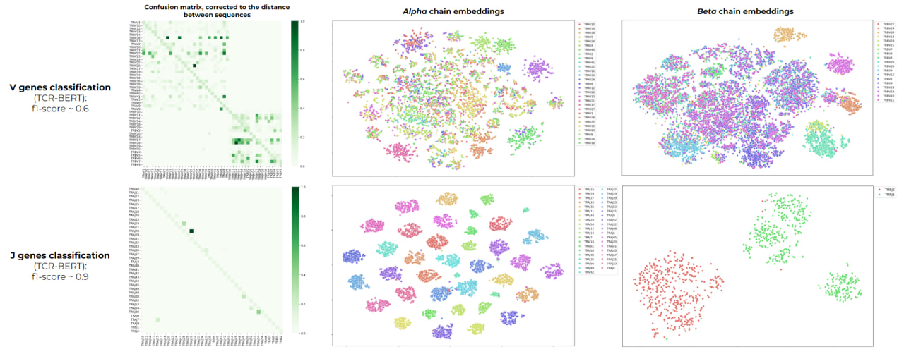
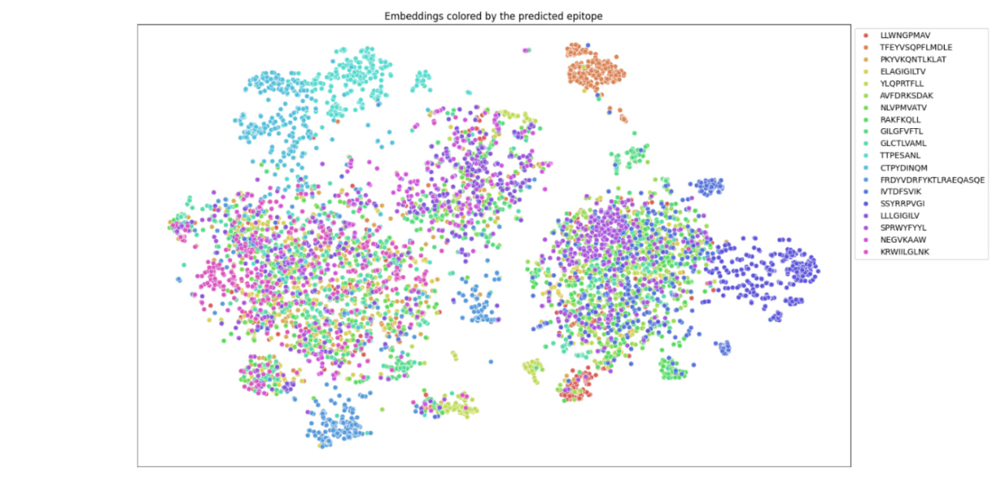
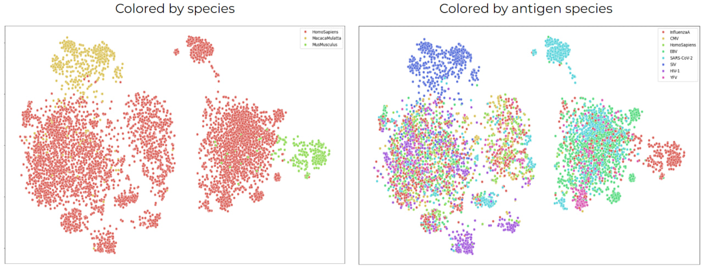

# Training a language model for T-cell receptor sequences and linking them to relevant scientific literature

## Problem statement:
T-cell receptors (TCRs)  are crucial components of the adaptive immune system, responsible for recognizing and binding to specific antigens. TCR is obtained as a result of recombination of variable (V), diversity (D), and joining (J)gene segments, which combine to form a receptor. The specific binding of a TCR to an epitope of Major Histocompatibility Complex (MHC) molecules triggers a cascade of immune responses aimed at eliminating the pathogen or infected cells. The enormous variability in TCR sequences makes it difficult to find matches to TCRs of interest in existing databases such as VDJdb.  
Recent advances in machine learning offer innovative approaches such as Bidirectional Encoder Representations from Transformers (BERT) models that can be used to find and match TCR sequences through the usage of sophisticated prediction algorithms.
The primary aim of this project is to develop a model that can identify the closest TCR matches, as well as antigen and receptor binding. This can be used to associate TCRs with diseases, antigens and link them to relevant publications.

## Navigation
| Name | Description |
|-----------------|-----------------|
| data    | contains all the data that used in the project    |
| my_model.py    | file with model code, containes all required functions and methond for the next usage     |
|  EDA___model_test.ipynb   | alpha / beta subunit prediction     |
|  Metrics.ipynb   |  performance model on new data  |
|  V_J_genes.ipynb   |  V and J genes prediction   |
|  D_genes.ipynb   |  J genes prediction   |
|  Visualisation.ipynb   |  visualisation  of genes prediction   |
|  epitopes   |  fine-tuning, usage, evaluation and visualisation  |
|  ft.yml   |  required packages for running the code  |


## Installation
To run the code, clone the repository and launch notebooks
``` python
git clone git@github.com:ailiskab-hub/nlp_tcr_predictor.git
```


## Results
Both models perfectly cope with this type of classification resulting in f1 score close >0.99. 
The second classification type tested was prediction of  V, J and D segments that were used in the recombination for a specific CDR3.  We obtained f1 score for V genes ~ 0.6, J genes ~ 0.9, D genes - 0.8. An error analysis of the models was performed, taking into account the similarity of the sequences. We obtained that errors are observed mainly in observations similar in sequence.

<p align="center">
  
</p> 

We used TCR-BERT to perform a more precise analysis and compared the scores derived from both chains together (f1 score 0.64) to the scores derived from single-chain embeddings (separately by alpha: f1 score ~ 0.44, separately by beta: f1 score ~ 0.57). Such results show that beta chain is more informative for embeddings generation, whereas the joint usage of chains generates the best classifier which shows the importance of both chain sequences for TCR-antigen classification task

<p align="center">
  
</p> 

Еhe model is more or less successful in separating clusters distinguishable by TCR belonging to the same epitope, species or antigen species. This indicates that the model  finds correct and biologically relevant patterns in the sequences.

<p align="center">
  
</p>
 
The models were also employed for the TCR-antigen binding task. This task is characterized as predicting whether or not the given TCR sequence and a given epitope sequence will bind to each other. The problem has been studied extensively because of its practical importance in clinic and treatment design. This requires first obtaining a dataset for TCR and epitope examples that do not bind to each other. The dataset was generated by randomized selection of non-binding receptors and epitopes. And for further work, we obtained embeddings derived separately using different models for receptor and epitope and used a fully connected neural network to classify the samples. The resulting model accuracy is about 0.56, which is an acceptable result for such a task, but also opens up space for improvement 


